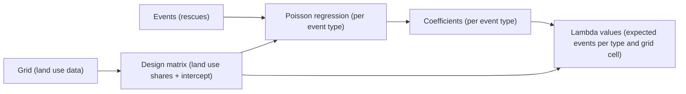
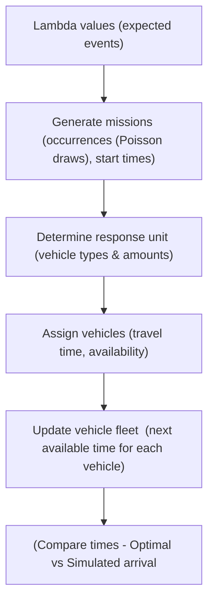

# CERTAIN - EvidenCE-basEd fossil fRee emergency service fleeT plAnnINg

This project combines **statistical modeling** and **simulation** to study how rescue service fleets perform under different scenarios.  

- **Part 1: Regression model (`poisson_regression.py`)**  
  Estimates how land use is related to the occurrence of rescue service interventions (e.g., accidents, fires, or other events) using **Poisson regression**. This produces expected event rates (λ) for each grid cell and event type.  

- **Part 2: Simulation model (`run_simulation.py`)**  
  Uses the expected event rates to simulate potential future events across the grid. These simulated events are then matched with rescue interventions, allowing us to test how well different rescue vehicle fleets perform.  
  - This enables scenario testing, e.g. what happens if the entire fleet is electric and needs extra charging time?  

---

## Part 1: Regression Model – Land Use and Events  

### Inputs  
- **Grid data**: each cell contains land use information.  
- **Event data**: observed rescue interventions linked to grid cells.  

### Method  
- A **design matrix** is built from the grid:  
  - Each column describes the share of land use types in a cell (area relative to the whole cell).  
  - An **intercept column** of ones is added.  
    - The intercept captures a *baseline level of events* that cannot be explained by land use alone.  
- Events are aggregated to the grid level (number of interventions per cell).  
- A **Poisson regression** is fitted for each event type: 
**log(λ) = Xβ**

- The coefficients are estimated by **maximum likelihood**, by minimizing the negative log-likelihood.  

### Outputs  
- Estimated **coefficients** (β) for each event type (`coefficients.csv`).  
- **Lambda values** (λ) for each grid cell and event type (`lambda_vals.csv`).  
  - These values represent the **best fitted estimates of the expected number of events of a specific type**, given the land use in each cell.  

---

### Regression Workflow  

---

## Part 2: Simulation Model – Testing Rescue Fleets  

The simulation setup uses the estimated **lambda values** to generate potential rescue interventions and test how well different rescue vehicle fleets perform.  

### Components  
1. **Vehicle data**  
   - Implemented in `VehicleDataTable`.  
   - Contains properties of vehicles, such as maximum speed and (if electric) charging time.  

2. **Travel times and station locations**  
   - Implemented in `TravelTimeModel`.  
   - Provides travel times between grid cells and stations, and defines which vehicles belong to which stations.  

3. **Event generation (missions)**  
   - Implemented in `RegrModel`.
   - For each grid cell and event type, a number of events are generated with: 
   **y ~ Poisson(λ)**
   - Each event becomes a *mission* with a location and start time.
     - As of now, the start time is drawn randomly. This can be refined.

4. **Response units**  
   - A response unit is the required composition and number of vehicles for a given event type.  
   - Currently, compositions are generated by randomly picking from the observed combinations (of the specific event type) found in the input event data.  

5. **Simulation time interval**  
   - Must match the period used when estimating the lambda values, to ensure consistency.  

---

### Running the Simulation  

A list of missions is created with start times. For each mission, the simulation:  

- **Determines the required response unit** (the types and numbers of vehicles needed).  
- **Selects the best suited vehicles** of the required types. *Best suited* here means the vehicles that can reach the mission location the fastest.  
- **Accounts for vehicle availability**: each vehicle has a `next_avail_time`, which is updated when it finishes a mission and returns to its station (including charging time if relevant).  
- **Calculates the simulated arrival time**. This may differ from the **optimal arrival time** (the time if all vehicles were free at mission start), since vehicles can be occupied or unavailable.  

This allows us to compare:  
- **Optimal arrival time** = if all vehicles were free at mission start.  
- **Simulated arrival time** = actual arrival time under realistic fleet constraints.  

---

### Simulation Workflow  

---

## Limitations (current version)  

- Event start times are currently drawn **randomly** and do not account for:  
  - Seasonal variations,  
  - Time of day, or  
  - Weekly/daily patterns.  
- These temporal effects can be incorporated in future versions to improve realism.  

---

## Project Purpose  

By combining **statistical modeling** with **simulation**, this project provides a framework for:  
- Understanding how land use patterns drive demand for rescue interventions.  
- Simulating realistic future event scenarios.  
- Testing how different fleet configurations (e.g., fully electric fleets, mixed fleets, or alternative station placements) perform under varying conditions.  
